# Normalized Weighted Positional Similarity (NWPS): Reference-Fidelity Evaluation for Ranked Lists

**Raul Carlomagno**  
**Research Release v0.1.0 — September 2026**

## Abstract

Ranking evaluation measures encode different notions of quality. Recall@K
measures set coverage, Mean Reciprocal Rank emphasizes the first relevant hit,
NDCG evaluates graded relevance under rank discounting, and rank-correlation
statistics quantify ordering agreement. Other families address top weighting,
incomplete rankings, reference directionality, ties, or positional deviation.

This report defines **Normalized Weighted Positional Similarity (NWPS)** for a
narrower problem: **fidelity to a privileged reference ranking**. The evaluator
cares about the identity of specific reference items, gives greater importance
to the reference head, penalizes positional displacement smoothly, and
separates omission from reordering.

Let \(h>0\) denote a rank half-life and \(\rho=2^{-1/h}\). Reference-position
mass follows a normalized geometric distribution,

\[
w_i=\frac{(1-\rho)\rho^{i-1}}{1-\rho^k},
\]

and a retrieved item displaced by \(d\) ranks receives positional credit
\(q=\rho^d\). A confirmed missing item receives zero credit. The strict-ranking
score is

\[
\operatorname{NWPS}(R,P;h)=\sum_iw_iq_i,
\]

with \(0\le\operatorname{NWPS}\le1\).

The central diagnostic property is the exact factorization

\[
\operatorname{NWPS}=C\,F,
\]

where \(C\) is weighted reference coverage and \(F\) is conditional positional
fidelity among observed reference mass. This yields

\[
1-\operatorname{NWPS}=(1-C)+C(1-F),
\]

separating omission loss from positional loss.

The release also specifies reference ties as admissible rank intervals,
prediction ties as uncertainty over resolved positions, and right-censored
predictions as fidelity intervals rather than confirmed omissions. Strict
censoring supports both an inexpensive itemwise upper relaxation and a tighter
joint-assignment upper bound. A stable `NWPSResult` object is returned for both
point-valued and censored evaluation.

The rank half-life is an explicit modeling assumption. It can be chosen from a
semantic displacement-retention policy, calibrated on development judgments,
or analyzed through sensitivity profiles. Raw NWPS is a direct fidelity score;
when a null model is justified, an optional chance-adjusted `NWPS Skill` layer
maps null expectation to zero.

NWPS is not proposed as a universal retrieval metric or mathematical distance.
The closest reviewed alternatives include WS, RDQ, Rank-Biased Alignment,
Compatibility/CMP, generalized Footrule/Kendall, RBO and tie-aware RBO,
Canberra ranked-list distance, weighted Kendall, and tau_AP. Controlled
benchmarks in this release are intentionally non-promotional and show that
other metrics can outperform NWPS under synthetic objectives. External human
validation remains a separate empirical requirement.

---

# 1. Evaluation Problem

NWPS addresses the question:

> **How faithfully does a produced ranking preserve a privileged reference
> ordering, and is any loss caused by missing important reference items or by
> moving retained items?**

This question is narrower than generic retrieval quality.

Let the reference horizon be

\[
R_k=(r_1,\ldots,r_k)
\]

and let the observed prediction be

\[
P_m=(p_1,\ldots,p_m).
\]

The roles of \(k\) and \(m\) differ:

- \(k\) defines which reference items are in evaluation scope;
- \(m\) defines how much of the produced ranking is observed.

A predicted item below reference depth \(k\) remains evaluable if its rank is
observed.

NWPS is directional because the reference supplies priority and acceptable
positions:

\[
NWPS(R,P)\neq NWPS(P,R)
\]

in general.

## 1.1 Intended use

The strongest use cases are:

- reranker regression testing against a trusted baseline;
- teacher–student ranking distillation;
- canonical expert rankings;
- retrieval-drift monitoring;
- curated RAG passage rankings;
- any evaluation where identity-specific fidelity to an intended order is the
  target itself.

NWPS should not be used when there is no privileged order, when only coverage
matters, when only the first relevant hit matters, or when graded relevance is
the actual ground truth and arbitrary order inside a grade should not matter.

---

# 2. Prior Art and Claim Boundary

The ranking-comparison literature is mature. NWPS does not claim that any of
the following ideas are individually new:

- asymmetric comparison to a reference ranking;
- top-weighted ranking similarity;
- geometric or exponential rank decay;
- weighted positional displacement;
- ordinal-reference evaluation;
- ties in rank similarity;
- incomplete/nonconjoint ranking comparison;
- censoring-aware ranking comparison.

A structured review is provided in
[`docs/prior_art_review.md`](docs/prior_art_review.md).

## 2.1 Closest measures

### WS

Sałabun and Urbaniak's WS coefficient is asymmetric, reference-based,
top-weighted, and item-displacement-sensitive. It is a mandatory baseline.

### RDQ

RDQ (Zhou, Moschitti, and Class, 2026) evaluates candidate rankings against an
Ordered Reference List. Its M2 penalty is exponential in rank deviation and its
parameters control misordering tolerance. RDQ also provides strong empirical
meta-evaluation on 5,000 POI queries and TREC Deep Learning data.

The key semantic contrast is that RDQ weights **produced positions**, whereas
NWPS assigns mass from **reference positions** and asks how much intended
priority survives.

### Rank-Biased Alignment

RBA (Moffat et al., 2024) is a top-weighted ranking-to-ranking measure and is
implemented in the `rbstar` family. It narrows any broad novelty claim around
"top-weighted ranking vs ranking" evaluation.

### Compatibility/CMP

Clarke, Vtyurina, and Smucker evaluate rankings against weak preference
structures by maximizing similarity to rankings consistent with those
preferences. This is highly relevant when the reference is a partial order.

### Generalized Footrule/Kendall

Kumar and Vassilvitskii provide a broader metric framework with element weights,
position weights, and element distances. NWPS is not more general and does not
claim metric axioms.

### RBO and tie-aware RBO

RBO compares indefinite rankings through persistence-weighted prefix overlap.
Corsi and Urbano formalize tie-aware variants, including `RBO^a`, which is the
expected RBO over random tie resolutions under uncertainty semantics.

### Domain-specific reference-ranking calibration

Juan et al. (2020) define genome-similarity Ranking Score / Ranking Accuracy
measures using a reference ranking with tied relation groups, displacement outside
admissible group borders, and explicit calibration against expected random
misranking. The application is domain-specific and the mathematics differ from
NWPS, but it is an important precedent for reference intervals, positional
deviation, and chance-level interpretation.

## 2.2 Narrow contribution hypothesis

The strongest NWPS-specific candidate contribution is the integrated semantics:

\[
\boxed{
\text{reference-priority mass}
+
\text{identity-specific displacement credit}
+
C\times F
+
\text{tie semantics}
+
\text{censor-aware bounds}
}
\]

combined with a single rank-persistence scale.

The structured review did not identify this exact combination in the closest
sources examined. This is a bounded literature finding, not proof of absolute
novelty.

---

# 3. Rank Half-Life

Let

\[
h>0
\]

be the **rank half-life**, and define

\[
\boxed{\rho=2^{-1/h}.}
\tag{1}
\]

Then

\[
\rho^h=\frac12.
\]

Operationally:

> a displacement of \(h\) ranks retains half of positional credit.

Base NWPS deliberately uses the same \(\rho\) for reference-priority decay.

## 3.1 Shared persistence assumption

The model imposes

\[
\frac{w_{i+1}}{w_i}=\rho
\]

and

\[
\frac{q(d+1)}{q(d)}=\rho.
\]

Thus one additional rank step has the same multiplicative persistence meaning
in two places:

1. moving deeper in reference priority;
2. moving farther from the intended position.

This coupling is parsimonious and yields useful algebraic structure, but it is
also a modeling assumption. A half-life calibrated only from displacement
semantics is defensible only when the same persistence is acceptable for
reference-priority decay. Otherwise, calibrate \(h\) against overall
reference-fidelity judgments or report sensitivity.

---

# 4. Reference Weights

For reference depth \(k\), define

\[
\boxed{
w_i=
\frac{(1-\rho)\rho^{i-1}}
{1-\rho^k},
\qquad i=1,\ldots,k.
}
\tag{2}
\]

The weights are positive and normalized:

\[
\boxed{\sum_{i=1}^{k}w_i=1.}
\tag{3}
\]

## 4.1 Persistent head mass

The top weight satisfies

\[
w_1=\frac{1-\rho}{1-\rho^k}
\]

and therefore

\[
\boxed{\lim_{k\to\infty}w_1=1-\rho>0.}
\tag{4}
\]

The cumulative mass of the top \(r\) ranks is

\[
\boxed{
W_{\le r}=
\frac{1-\rho^r}{1-\rho^k}.
}
\tag{5}
\]

This makes head importance persistent as the reference horizon grows.

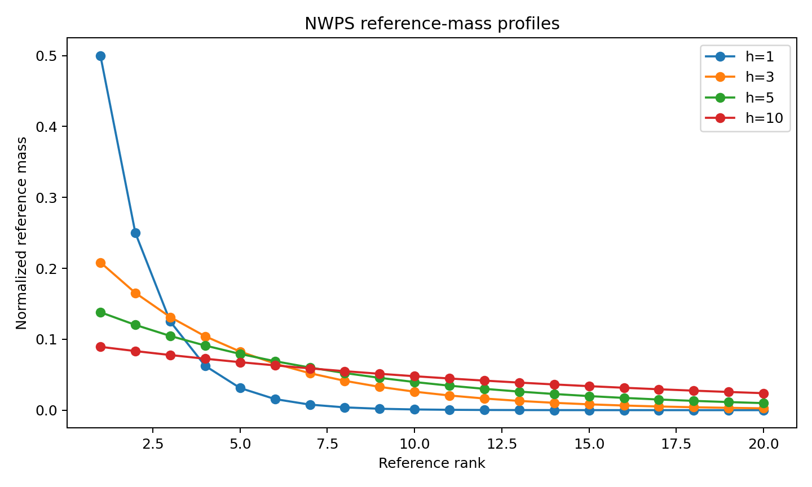

---

# 5. Positional Credit

For a retrieved reference item \(r_i\) at predicted position \(j\), define

\[
d_i=|i-j|.
\tag{6}
\]

Its positional credit is

\[
\boxed{q_i=\rho^{d_i}.}
\tag{7}
\]

Therefore

\[
0<q_i\le1.
\]

A one-position displacement always multiplies credit by \(\rho\), independent
of \(k\).

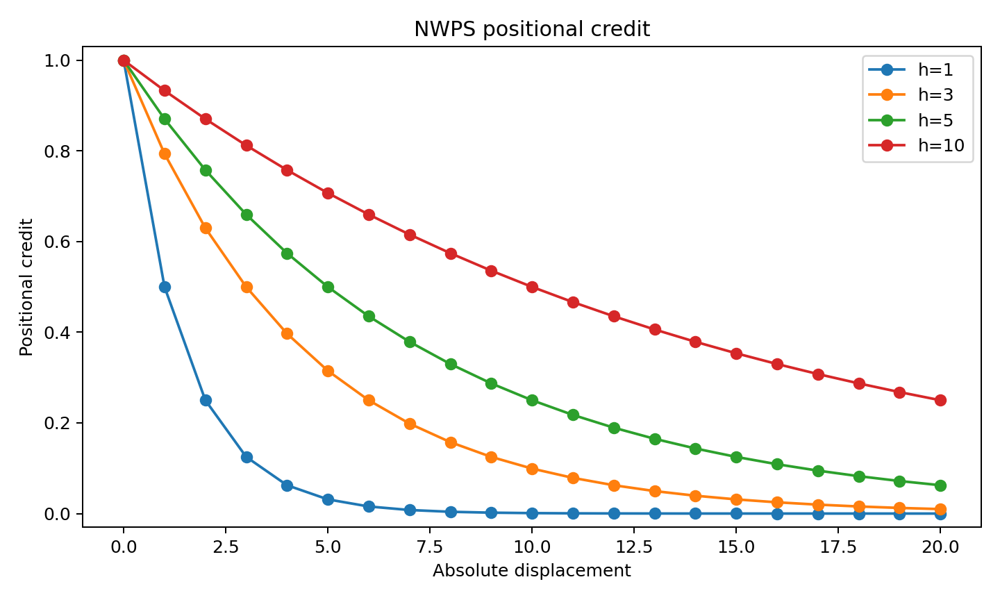

## 5.1 Confirmed omission

If the item is confirmed absent under the evaluation contract,

\[
\boxed{q_i=0.}
\tag{8}
\]

---

# 6. NWPS Definition

For a strict reference and complete observation:

\[
\boxed{
NWPS(R,P;h)=\sum_{i=1}^{k}w_iq_i.
}
\tag{9}
\]

Equivalently,

\[
\boxed{
NWPS(R,P;h)=
\sum_{i:r_i\in P}
\frac{(1-\rho)\rho^{i-1}}{1-\rho^k}
\rho^{|i-\pi_P(r_i)|}.
}
\tag{10}
\]

## 6.1 Bounds

Because \(w_i\ge0\), \(q_i\in[0,1]\), and the weights sum to one,

\[
\boxed{0\le NWPS\le1.}
\tag{11}
\]

## 6.2 Identity

\[
\boxed{NWPS(R,R;h)=1.}
\tag{12}
\]

## 6.3 Confirmed disjointness

If none of the evaluated reference items appears,

\[
\boxed{NWPS=0.}
\tag{13}
\]

---

# 7. Diagnostic Factorization

Define weighted reference coverage

\[
\boxed{
C=\sum_{i:r_i\in P}w_i.
}
\tag{14}
\]

For \(C>0\), define conditional positional fidelity

\[
\boxed{
F=
\frac{\sum_{i:r_i\in P}w_iq_i}{C}.
}
\tag{15}
\]

Set \(F=0\) if \(C=0\).

Then

\[
\boxed{NWPS=C\,F.}
\tag{16}
\]

The total loss is

\[
\boxed{
1-NWPS=(1-C)+C(1-F).
}
\tag{17}
\]

This has direct diagnostic semantics:

- \(1-C\): weighted omission loss;
- \(C(1-F)\): positional loss among retained reference mass.

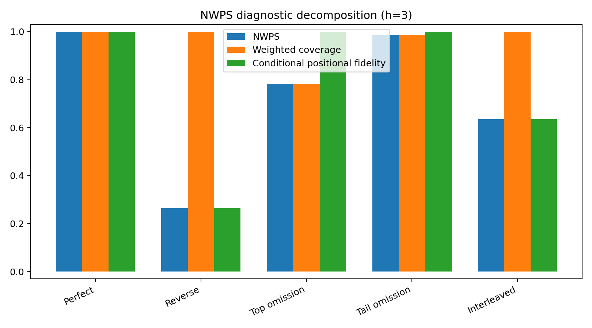

This factorization is one of the principal reasons to report NWPS together with
\(C\) and \(F\), rather than reporting the scalar alone.

---

# 8. Ties

NWPS distinguishes **reference indifference** from **prediction uncertainty**.

## 8.1 Reference ties

If a reference tie group occupies ranks \(a,\ldots,b\), its items share the
acceptable interval

\[
I_R=[a,b].
\]

Distance from predicted rank \(j\) to the interval is

\[
\boxed{
d(j,I_R)=
\begin{cases}
a-j,&j<a,\\
0,&a\le j\le b,\\
j-b,&j>b.
\end{cases}
}
\tag{18}
\]

Any strict ordering inside the reference tie interval receives zero displacement.

## 8.2 Reference mass inside a tie block

If group \(G\) occupies positions \(a,\ldots,b\), define

\[
W_G=\sum_{r=a}^{b}w_r.
\]

Each tied item receives

\[
\boxed{w_x=W_G/|G|.}
\tag{19}
\]

Thus arbitrary internal listing order cannot change item importance.

## 8.3 Prediction ties

If item \(x\) appears in a prediction tie block spanning ranks \(c,\ldots,d\),
NWPS assigns expected positional credit under uniform resolution:

\[
\boxed{
q_x=
\frac{1}{d-c+1}
\sum_{r=c}^{d}
\rho^{d(r,I_R(x))}.
}
\tag{20}
\]

A prediction tie against a strict reference therefore receives less than full
credit unless every possible resolved position is acceptable.

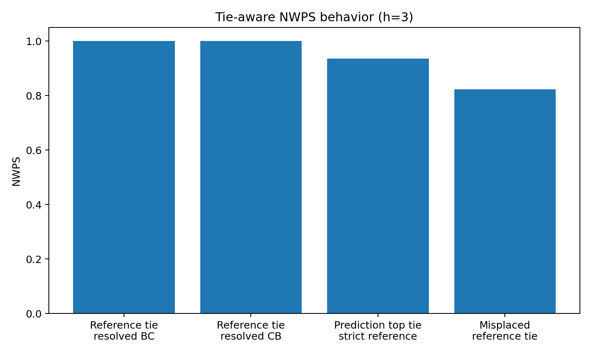

## 8.4 Relation to tie-aware RBO

Corsi and Urbano distinguish multiple tie semantics. Their `RBO^a` treats ties
as uncertainty and equals expected bare RBO over random tie resolutions. NWPS
reference ties instead encode declared **indifference**. The controlled tie
benchmark therefore shows different self-similarity behavior by design.

---

# 9. Right Censoring

A reference item absent from an observed prefix can be either:

1. confirmed absent from the produced ranking;
2. unobserved because only a prefix is available.

NWPS treats the second case as uncertainty.

## 9.1 Lower bound

Observed reference-item contributions give

\[
\boxed{
NWPS_L=\sum_{i\in O}w_iq_i.
}
\tag{21}
\]

## 9.2 Itemwise upper relaxation

For an unseen strict reference item at zero-based reference position \(i\) and
an observed prediction of length \(m\), the earliest unseen position is \(m\).
Its minimum possible displacement is

\[
d_i^{min}=\max(0,m-i).
\]

An independent-item relaxation gives

\[
NWPS_U^{item}=
NWPS_L+
\sum_{i\in U}w_i\rho^{d_i^{min}}.
\tag{22}
\]

This is a valid upper bound but may be loose because multiple items can be
assigned the same individually optimal future position.

## 9.3 Joint-assignment upper bound

For strict rankings the release therefore provides a tighter upper bound.
Unseen items are assigned to **distinct** future ranks to maximize total possible
contribution:

\[
\boxed{
NWPS_U^{joint}
=
NWPS_L+
\max_{\sigma}
\sum_{i\in U}w_i\rho^{|i-\sigma(i)|},
}
\tag{23}
\]

where \(\sigma\) is an injective assignment to future observed positions.

The implementation solves the finite assignment problem with the Hungarian
algorithm. Candidate positions from the censoring boundary through
\(\max(k-1,m+|U|-1)\) suffice for the strict case.

The default strict API uses the dependency-free itemwise relaxation. The tighter
joint-assignment bound is available explicitly when NumPy/SciPy are available.
The joint bound is a finite assignment optimization rather than part of the
linear-time point-score computation.

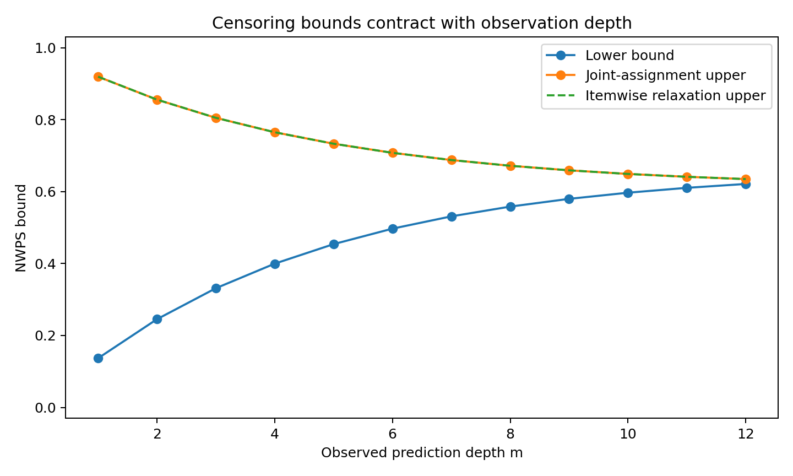

The tie-aware API currently exposes the itemwise censoring relaxation; its
point-valued tie semantics are fully implemented.

---

# 10. Theoretical Properties

## 10.1 Rank-step invariance

\[
\frac{q(d+1)}{q(d)}=\rho.
\]

The relative effect of one additional displacement step does not depend on
reference depth.

## 10.2 Persistent head

\[
\lim_{k\to\infty}w_1=1-\rho.
\]

## 10.3 Monotonicity

Since \(0<\rho<1\),

\[
q(d+1)<q(d).
\]

## 10.4 Persistence consistency for demotion

For a downward move from reference rank \(i\) to predicted rank \(j\ge i\),

\[
w_i\rho^{j-i}
=
\frac{(1-\rho)\rho^{j-1}}{1-\rho^k}.
\tag{24}
\]

Thus a demoted item's weighted contribution equals the reference-mass scale of
its deeper destination rank.

## 10.5 Promotions are not rewarded

An upward move still changes the privileged ordering and therefore reduces
fidelity. NWPS is not a utility metric where every promotion is beneficial.

## 10.6 Non-metric character

NWPS is directional and generally asymmetric. No triangle inequality is
claimed.

---

# 11. Half-Life Calibration

There is no universal half-life. The parameter should be treated as part of the
evaluation protocol.

## 11.1 Semantic calibration

If a task declares that displacement \(d^\star\) should retain fraction
\(r^\star\), then

\[
\boxed{
h=-\frac{d^\star\ln2}{\ln r^\star}.}
\tag{25}
\]

For example, retaining 80% credit after two ranks implies

\[
h\approx6.21.
\]

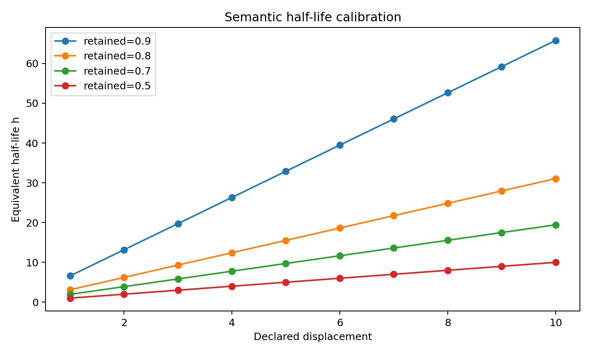

Because the same \(h\) also determines head weighting, semantic calibration
should acknowledge the shared-persistence assumption.

## 11.2 Development-set calibration

With external reference-fidelity judgments, estimate

\[
\boxed{
h^\star=\arg\max_h A(h)}
\tag{26}
\]

on a development set, where \(A\) can be pairwise accuracy, rank correlation,
or a preference-model likelihood.

Freeze \(h^\star\) before held-out test evaluation.

## 11.3 Sensitivity analysis

If no defensible single calibration source exists, report a curve or interval
across plausible \(h\) values.

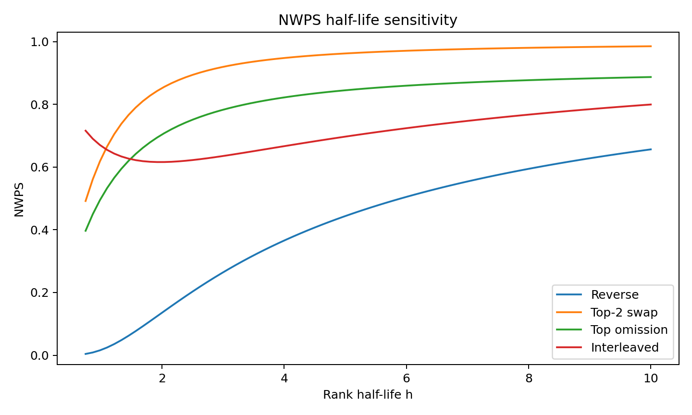

---

# 12. Chance Calibration

Raw NWPS measures direct fidelity. It is not internally chance-corrected.

## 12.1 Uniform complete-permutation baseline

For a uniformly random complete permutation of the same \(k\) items,

\[
\boxed{
B_{k,h}
=
\sum_{i=1}^{k}w_i
\frac{1}{k}
\sum_{j=1}^{k}\rho^{|i-j|}.
}
\tag{27}
\]

For fixed \(h\),

\[
\boxed{\lim_{k\to\infty}B_{k,h}=0.}
\tag{28}
\]

At finite \(k\), the expected score is positive because some random items land
near their reference positions.

## 12.2 NWPS Skill

For a declared null expectation \(B<1\), define the optional reporting transform

\[
\boxed{
NWPS_{skill}=\frac{NWPS-B}{1-B}.
}
\tag{29}
\]

Then perfect fidelity maps to 1 and null expectation maps to 0.

The minimum possible value is

\[
\boxed{-\frac{B}{1-B},}
\tag{30}
\]

not generally \(-1\).

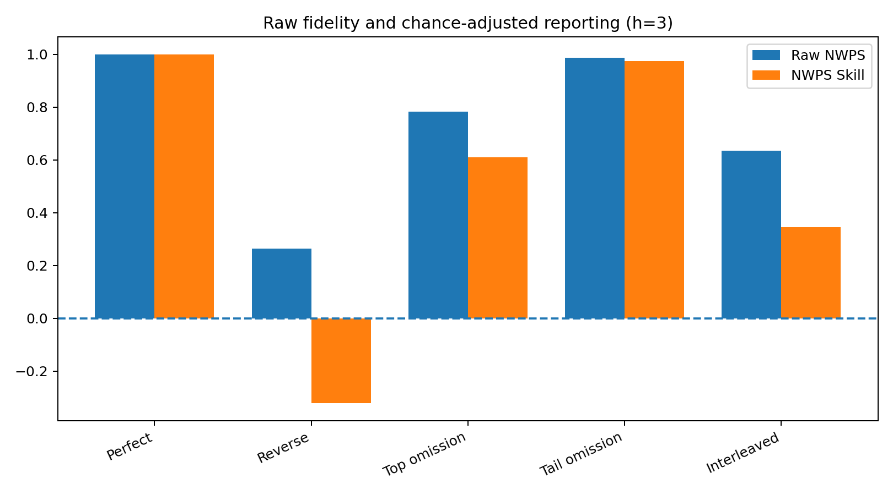

## 12.3 Query-specific nulls

For heterogeneous queries, one universal \(B\) is usually inappropriate.
A report should either:

- compute \(B_q\) per query and aggregate per-query skill scores;
- or state a different null-generation and aggregation rule explicitly.

For partial, tied, or censored outputs, Monte Carlo null models should preserve
relevant structure such as overlap, observed depth, tie blocks, and candidate
universe.

---

# 13. Reference Implementation

The canonical strict algorithm builds a positional hash map once and scans the
reference once.

For point-valued evaluation, and for the default itemwise censoring relaxation,
expected complexity is

\[
\boxed{O(k+m)}
\]

with

\[
\boxed{O(m)}
\]

auxiliary memory. The optional strict joint-assignment censoring bound adds a
Hungarian assignment step; if `u` reference items are unseen, the assignment
phase is cubic in `u` in the standard implementation.

The hash index is part of the canonical score computation itself.

## 13.1 Stable result type

All evaluators return `NWPSResult` with:

- `score` — point value or `None` when censored;
- `lower_bound`;
- `upper_bound`;
- `weighted_coverage_observed`;
- `conditional_positional_fidelity_observed`;
- `half_life`;
- reference/prediction depths;
- censoring metadata.

This avoids changing tuple shape according to a boolean mode.

## 13.2 Numerical stability

The implementation computes geometric normalizers with `math.expm1` rather than
naive subtraction. This preserves stable behavior when \(h\) is extremely large
and \(\rho\) is numerically close to one.

The test suite includes half-lives from \(10^{-12}\) through \(10^{300}\).

## 13.3 Strict API

```python
from nwps import nwps

result = nwps(
    reference=list("ABCDE"),
    predicted=list("ACBED"),
    half_life=3,
)
```

## 13.4 Tie-aware API

```python
from nwps import nwps_tied

result = nwps_tied(
    [("A",), ("B", "C"), ("D",)],
    [("A",), ("C",), ("B",), ("D",)],
    half_life=3,
)
```

The second example scores exactly 1 because the reference declares `B` and `C`
indifferent.

---

# 14. Comparator Implementations

The research package includes controlled implementations for meta-evaluation.
They are placed in `nwps.comparators`, not in the main API namespace.

Included:

- WS;
- RDQ M1/M2 for strict ORLs;
- RBO extrapolated point estimate;
- RBA strict lower/upper logic;
- Corsi–Urbano `RBO^a` for complete finite tied rankings at equal depth;
- directional tau_AP;
- Vigna/SciPy weighted Kendall;
- Canberra permutation distance;
- classical Footrule;
- a concrete normalized reference-weighted Footrule similarity.

The weighted-Footrule comparator is a concrete member of the weighted Footrule
family. It is **not** presented as a complete reimplementation of the full
Kumar–Vassilvitskii generalized-distance framework.

---

# 15. Controlled Benchmark

The release contains 40 deterministic controlled perturbations of a 13-item
reference ranking.

To avoid circular validation, the synthetic oracle uses a different structure:

- logarithmic head weights;
- hyperbolic positional credit \(1/(1+d)\).

This oracle is a stress-test target only, not human ground truth.

Spearman correlations are:

| Metric | Correlation with synthetic oracle |
|---|---:|
| Canberra distance, sign reversed | 0.994 |
| NWPS | 0.985 |
| Reference-weighted Footrule similarity | 0.982 |
| RBO | 0.978 |
| Weighted Kendall | 0.977 |
| RDQ M2, alpha=1 | 0.972 |
| WS | 0.955 |
| tau_AP | 0.936 |
| RBA upper | 0.930 |
| RDQ M2, alpha=4 | 0.890 |
| NDCG with synthetic linear grades | 0.845 |

The benchmark does not support a superiority claim. In particular, Canberra is
best aligned with this specific synthetic oracle.

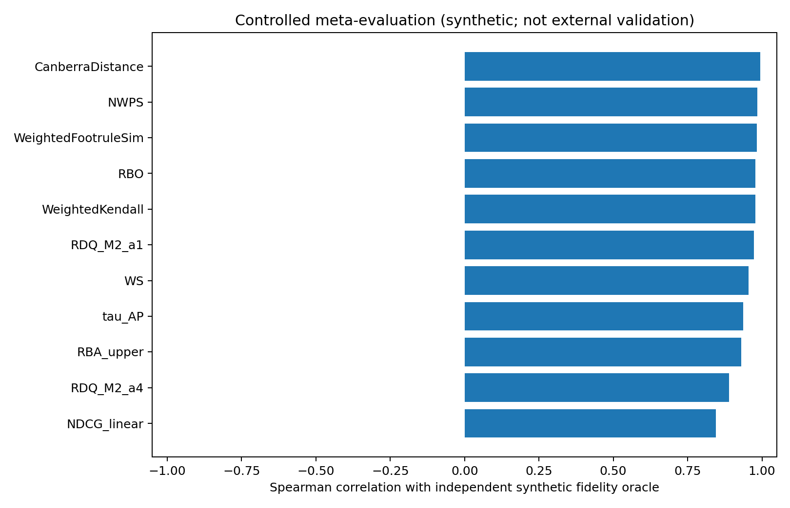

---

# 16. Tie Benchmark

The controlled tie comparison uses NWPS and Corsi–Urbano `RBO^a`.

| Case | NWPS tied | RBO^a |
|---|---:|---:|
| Same reference tie | 1.000 | 0.959 |
| Reference tie resolved B,C | 1.000 | 0.959 |
| Reference tie resolved C,B | 1.000 | 0.959 |
| Prediction top tie vs strict reference | 0.937 | 0.897 |
| Misplaced reference tie | 0.823 | 0.712 |

The discrepancy in the first rows reflects semantics, not an implementation
error: NWPS reference ties mean declared indifference, whereas `RBO^a` treats a
tie as uncertainty over an underlying strict order.

---

# 17. Calibration Pipeline Demonstration

The release includes a deterministic synthetic calibration experiment with
1,200 candidate rankings.

The synthetic oracle again differs structurally from NWPS. Data are split into:

- 720 train cases;
- 240 development cases;
- 240 held-out test cases.

The development objective selects \(h\) by Spearman agreement.

Current deterministic result:

- selected \(h=3.0561\);
- development Spearman = 0.8752;
- held-out test Spearman = 0.8766;
- held-out pairwise accuracy = 0.8605.

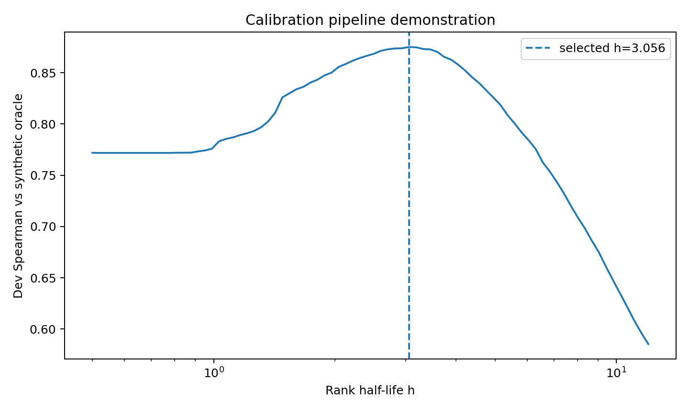

These results validate the **calibration pipeline**, not NWPS against human
judgment.

---

# 18. Human/Expert Judgment Set

The repository includes a 200-pair annotation template:

`data/human_judgment_template.jsonl`

Each record contains:

- a reference ranking;
- candidate A;
- candidate B;
- generation metadata;
- empty pairwise preference, confidence, severity, assessor, and notes fields.

The companion annotation guide instructs assessors to judge:

> Which candidate ranking better preserves the reference ranking?

Metric scores must remain hidden until annotation is frozen.

No generated label is presented as a human judgment.

---

# 19. Synthetic System Stability and Power

A second experiment generates 800 synthetic queries and six system profiles
ranging from near-exact to severe coverage/order drift.

The objective is to exercise meta-evaluation machinery similar to that used in
contemporary IR metric papers.

## 19.1 System-ranking stability

At 100 sampled queries, mean Kendall agreement with each metric's own
full-query system ordering is:

| Metric | Mean tau |
|---|---:|
| RBA | 0.962 |
| RDQ | 0.961 |
| NDCG | 0.952 |
| RBO | 0.938 |
| NWPS | 0.937 |

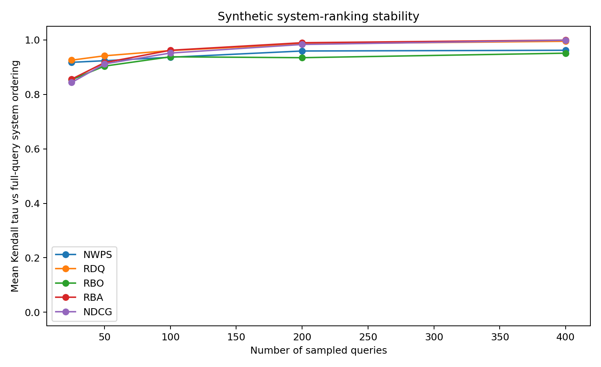

## 19.2 Empirical rejection-rate power proxy

At 100 queries, mean pairwise rejection rate under repeated paired t-tests is:

| Metric | Mean rejection rate |
|---|---:|
| RDQ | 0.904 |
| NWPS | 0.897 |
| RBO | 0.852 |
| NDCG | 0.796 |
| RBA | 0.791 |

These are synthetic data and do not imply that one metric has greater power on
real test collections.

The important point is that the repository contains the machinery to measure
system stability and empirical discriminative power without assuming NWPS must
win.

---

# 20. Verification

The release includes exact and randomized verification.

## 20.1 Exhaustive permutation tests

For small complete rankings, every permutation is enumerated to verify:

- bounds;
- exact identity;
- uniqueness of the identity maximum;
- equality between the analytic random baseline and the exhaustive arithmetic
  mean.

The random-baseline equality is checked through \(n=7\).

## 20.2 Censoring verification

For small strict cases, every possible completion of a censored prefix is
enumerated and verified to lie below the joint-assignment upper bound.

The joint upper bound is also checked to be no looser than the itemwise
relaxation.

## 20.3 Randomized property sweeps

The deterministic randomized suite performs:

- 2,000 strict-ranking cases with random permutations, distractors, and
  half-lives;
- 300 random reference-tie block cases.

Properties include bounds, exact factorization, and invariance inside declared
reference tie blocks.

## 20.4 Numerical extremes

Weights and identity are tested for half-lives ranging from
\(10^{-12}\) to \(10^{300}\).

Current suite result:

```text
35 passed
```

---

# 21. Comparison Summary

| Property | NWPS | WS | RDQ | RBA | RBO | Weighted Footrule |
|---|---|---|---|---|---|---|
| Privileged reference | Yes | Yes | Yes | No/symmetric alignment | No | Depends on formulation |
| Reference-anchored importance | Yes | Yes | ORL quality + output-position weights | Both ranks | Prefixes | Configurable |
| Explicit item displacement | Yes | Yes | Yes | Joint rank alignment | Indirect through prefix overlap | Yes |
| Missing reference items | Zero mass contribution | Base complete ranking | Zero credit | Reduced alignment | Reduced overlap | Requires convention |
| Tie-aware | Yes | Limited in base | Yes | Toolkit supports ties | Yes via dedicated variants | Depends on extension |
| Right-censor interval | Yes | No base | Cutoff-based point score | Bounds in rank-biased family | Bounds | Depends on extension |
| Diagnostic `C × F` | Yes | No | No identical factorization | No | No | No |
| Mathematical metric | No | No | No | No | No | Generalized family can be metric |

---

# 22. Reporting Protocol

A serious NWPS result should report assumptions and components.

Example:

```text
reference depth:                   k = 20
rank half-life:                    h = 3
half-life source:                  held-out development calibration

NWPS@20(h=3):                      0.82
weighted coverage C:               0.91
conditional positional fidelity F: 0.901

null model:                        query-specific complete permutation
null expectation B:                0.24
NWPS Skill:                        0.763
```

For censoring:

```text
observed prediction depth:         m = 20
NWPS@20(h=3):                      [0.71, 0.79]
upper-bound method:                joint-assignment
```

For heterogeneous queries, any skill aggregation rule must be stated explicitly.

---

# 23. Limitations

## 23.1 Half-life is not universal

The parameter is a task assumption. Semantic calibration improves
interpretability but does not remove the assumption.

## 23.2 Shared persistence can be wrong for some tasks

Some applications may want one head-decay scale and another displacement scale.
Base NWPS deliberately avoids the extra degree of freedom.

## 23.3 Tie semantics are normative

Reference ties mean indifference; prediction ties mean uncertainty. Other
semantics are possible.

## 23.4 Tie-aware censoring is currently looser than strict censoring

The tie-aware API uses the itemwise relaxation for censored outputs. The tight
joint-assignment upper bound is implemented for strict rankings.

## 23.5 Chance adjustment depends on a null model

`NWPS Skill` has no meaning without a defensible declared baseline.

## 23.6 External validation is not yet claimed

Synthetic calibration, stability, power, and controlled benchmarks demonstrate
machinery and behavior. They do not substitute for human/expert judgments or a
public real-system benchmark.

## 23.7 Closely related measures exist

RDQ, RBA, WS, Compatibility, generalized weighted distances, RBO, and other
families cover substantial neighboring territory. NWPS should be judged by
whether its reference-mass semantics and diagnostic decomposition prove useful.

---

# 24. Reproducibility

Repository structure:

```text
.
├── README.md
├── nwps_report.md
├── pyproject.toml
├── Makefile
├── CITATION.cff
├── docs/
│   └── prior_art_review.md
├── src/nwps/
├── tests/
├── experiments/
├── data/
├── results/
└── images/
```

Core commands:

```bash
make test
make figures
make experiments
```

The experiment scripts use fixed random seeds and write their outputs into
`results/` and `images/`.

---

# 25. Conclusion

NWPS is a specialized directional similarity for **reference-ranking fidelity**.
Its definition combines persistent reference-position mass with exponential
identity-specific positional credit:

\[
NWPS=\sum_iw_iq_i.
\]

Its central diagnostic interpretation is

\[
\boxed{NWPS=C\,F,}
\]

which separates weighted coverage from conditional positional fidelity.

The release provides a stable Python API, tie-aware evaluation, right-censoring
bounds, numerically stable weights, chance calibration helpers, exact and
randomized verification, controlled comparator implementations, synthetic
calibration/stability/power pipelines, an unlabeled human judgment template, and
a structured prior-art review.

The appropriate scientific claim is deliberately narrow: NWPS is a candidate
reference-fidelity diagnostic, not a universal ranking metric and not a proven
replacement for RDQ, RBA, WS, RBO, NDCG, weighted Footrule, or correlation
measures. Its remaining scientific test is external validation on real
reference-fidelity judgments and systems.

---

# References

1. P. Diaconis and R. L. Graham. “Spearman’s Footrule as a Measure of Disarray.” *JRSS B*, 1977. DOI: 10.1111/j.2517-6161.1977.tb01624.x
2. R. Fagin, R. Kumar, and D. Sivakumar. “Comparing Top k Lists.” *SIAM Journal on Discrete Mathematics*, 2003. DOI: 10.1137/S0895480102412856
3. D. Quade and I. A. Salama. “Concordance of Complete or Right-Censored Rankings Based on Spearman's Footrule.” 2006. DOI: 10.1080/03610920600580091
4. E. Yilmaz, J. A. Aslam, and S. Robertson. “A New Rank Correlation Coefficient for Information Retrieval.” SIGIR 2008. DOI: 10.1145/1390334.1390435
5. G. Jurman et al. “Algebraic Stability Indicators for Ranked Lists in Molecular Profiling.” *Bioinformatics*, 2008.
6. R. Kumar and S. Vassilvitskii. “Generalized Distances Between Rankings.” WWW 2010. DOI: 10.1145/1772690.1772749
7. W. Webber, A. Moffat, and J. Zobel. “A Similarity Measure for Indefinite Rankings.” *TOIS*, 2010. DOI: 10.1145/1852102.1852106
8. G. Jurman et al. “Algebraic Comparison of Partial Lists in Bioinformatics.” *PLOS ONE*, 2012. DOI: 10.1371/journal.pone.0036540
9. S. Vigna. “A Weighted Correlation Index for Rankings with Ties.” WWW 2015. DOI: 10.1145/2736277.2741088
10. W. Sałabun and K. Urbaniak. “A New Coefficient of Rankings Similarity in Decision-Making Problems.” ICCS 2020. DOI: 10.1007/978-3-030-50417-5_47
11. C. L. A. Clarke, A. Vtyurina, and M. D. Smucker. “Offline Evaluation without Gain.” ICTIR 2020. DOI: 10.1145/3409256.3409816
12. C. L. A. Clarke, M. D. Smucker, and A. Vtyurina. “Offline Evaluation by Maximum Similarity to an Ideal Ranking.” CIKM 2020. DOI: 10.1145/3340531.3411915
13. M. Corsi and J. Urbano. “The Treatment of Ties in Rank-Biased Overlap.” SIGIR 2024. DOI: 10.1145/3626772.3657700
14. A. Aveni, L. Crippa, and G. Principi. “On the Weighted Top-Difference Distance: Axioms, Aggregation, and Approximation.” 2024. arXiv:2403.15198
15. A. Moffat, J. Mackenzie, A. Mallia, and M. Petri. “Rank-Biased Quality Measurement for Sets and Rankings.” SIGIR-AP 2024. DOI: 10.1145/3673791.3698405
16. A. Moffat et al. “A Flexible Resource for Top-Weighted Comparisons Between Sets and Rankings.” SIGIR 2025.
17. “Nonparametric Significance Test of the Weighted Similarity Coefficient.” *Journal of Computational Science*, 2026.
18. X. Zhou, A. Moschitti, and D. Class. “Rank-Deviation Quality: A Distance-Aware Metric for Multi-Answer Retrieval and Ranking Evaluation.” arXiv:2608.25318, 2026.
19. L. Juan et al. “Evaluating individual genome similarity with a topic model.” *Bioinformatics*, 2020. DOI: 10.1093/bioinformatics/btaa583
